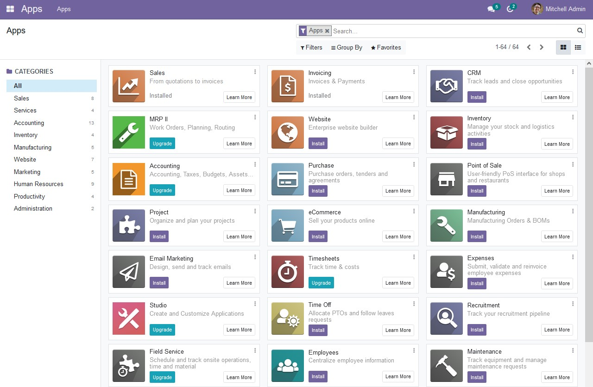

<!--
N.B.: This README was automatically generated by https://github.com/YunoHost/apps/tree/master/tools/README-generator
It shall NOT be edited by hand.
-->

# Odoo for YunoHost

[](https://dash.yunohost.org/appci/app/odoo)    
[](https://install-app.yunohost.org/?app=odoo)

*[Lire ce readme en français.](./README_fr.md)*

> *This package allows you to install Odoo quickly and simply on a YunoHost server.
If you don't have YunoHost, please consult [the guide](https://yunohost.org/#/install) to learn how to install it.*

## Overview

Suite of business apps that cover all your company needs: CRM, eCommerce, accounting, inventory, point of sale, project management, etc.

(from Odoo's website)


**Shipped version:** 15.0.20220107~ynh1

**Demo:** https://www.odoo.com/trial

## Screenshots



## Disclaimers / important information

### Licence

This YunoHost package installs Odoo Community Edition, which is open source and comes with a set of free apps.
However, Odoo's interface also promotes the Entreprise edition and its apps, which are neither free nor open source.

### Installation

The app requires its own domain or subdomain.

### Authentication

Default username and password are `admin`. :warning: *Change the password after installation!*

The LDAP module is enabled but not configured.

1. Go into the Settings, Integrations section, LDAP Server.
2. Create a first LDAP server, and select your company.
3. Fill in the fields:
- LDAP base: `ou=users,dc=yunohost,dc=org`
- LDAP filter: `(&(objectClass=posixAccount)(permission=cn=odoo.user,ou=permission,dc=yunohost,dc=org))`

Save and reload page. YunoHost users with the `odoo.user` permission will be able to log into Odoo.

## Documentation and resources

* Official app website: https://odoo.com
* Official user documentation: https://www.odoo.com/documentation/15.0/applications.html
* Official admin documentation: https://www.odoo.com/documentation/15.0/administration.html
* Upstream app code repository: https://github.com/odoo/odoo
* YunoHost documentation for this app: https://yunohost.org/app_odoo
* Report a bug: https://github.com/YunoHost-Apps/odoo_ynh/issues

## Developer info

Please send your pull request to the [testing branch](https://github.com/YunoHost-Apps/odoo_ynh/tree/testing).

To try the testing branch, please proceed like that.
```
sudo yunohost app install https://github.com/YunoHost-Apps/odoo_ynh/tree/testing --debug
or
sudo yunohost app upgrade odoo -u https://github.com/YunoHost-Apps/odoo_ynh/tree/testing --debug
```

**More info regarding app packaging:** https://yunohost.org/packaging_apps