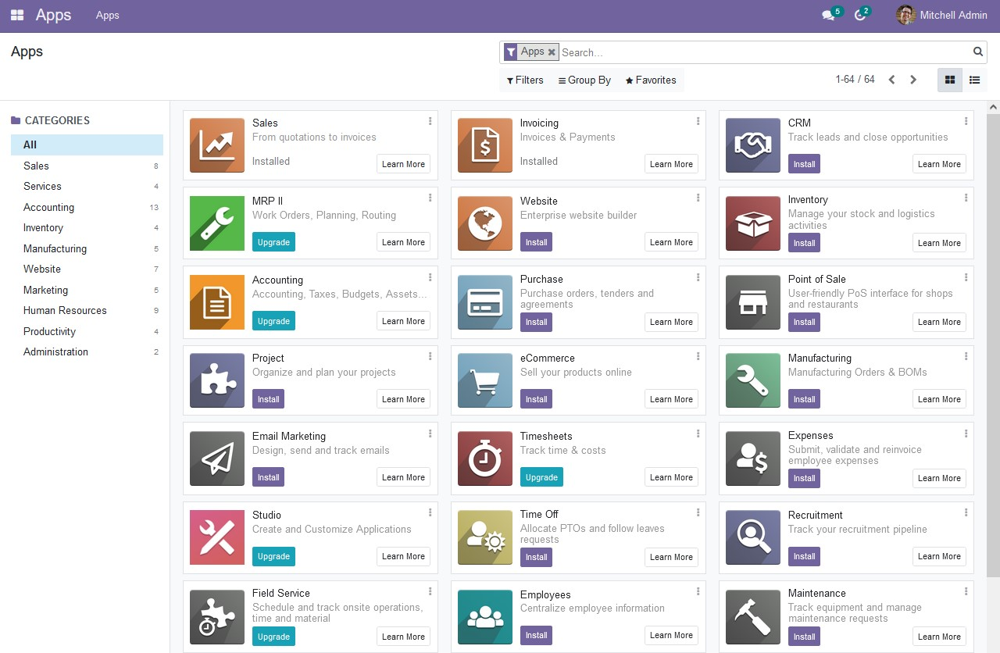

# Odoo pour YunoHost

[](https://dash.yunohost.org/appci/app/odoo)    
[](https://install-app.yunohost.org/?app=odoo)

*[Read this readme in english.](./README.md)*
*[Lire ce readme en français.](./README_fr.md)*

> *Ce package vous permet d'installer Odoo rapidement et simplement sur un serveur YunoHost.
Si vous n'avez pas YunoHost, regardez [ici](https://yunohost.org/#/install) pour savoir comment l'installer et en profiter.*

## Vue d'ensemble

Suite of business apps that cover all your company needs: CRM, eCommerce, accounting, inventory, point of sale, project management, etc.

(from Odoo's website)


**Version incluse :** 15.0.20220107~ynh1

**Démo :** https://www.odoo.com/trial

## Captures d'écran



## Avertissements / informations importantes

### Licence

This YunoHost package installs Odoo Community Edition, which is open source and comes with a set of free apps.
However, Odoo's interface also promotes the Entreprise edition and its apps, which are neither free nor open source.

### Installation

The app requires its own domain or subdomain.

### Authentication

Default username and password are `admin`. :warning: *Change the password after installation!*

The LDAP module is enabled but not configured.

1. Go into the Settings, Integrations section, LDAP Server.
2. Create a first LDAP server, and select your company.
3. Fill in the fields:
- LDAP base: `ou=users,dc=yunohost,dc=org`
- LDAP filter: `(&(objectClass=posixAccount)(permission=cn=odoo.user,ou=permission,dc=yunohost,dc=org))`

Save and reload page. YunoHost users with the `odoo.user` permission will be able to log into Odoo.

## Documentations et ressources

* Site officiel de l'app : https://odoo.com
* Documentation officielle utilisateur : https://www.odoo.com/documentation/15.0/applications.html
* Documentation officielle de l'admin : https://www.odoo.com/documentation/15.0/administration.html
* Dépôt de code officiel de l'app : https://github.com/odoo/odoo
* Documentation YunoHost pour cette app : https://yunohost.org/app_odoo
* Signaler un bug : https://github.com/YunoHost-Apps/odoo_ynh/issues

## Informations pour les développeurs

Merci de faire vos pull request sur la [branche testing](https://github.com/YunoHost-Apps/odoo_ynh/tree/testing).

Pour essayer la branche testing, procédez comme suit.
```
sudo yunohost app install https://github.com/YunoHost-Apps/odoo_ynh/tree/testing --debug
ou
sudo yunohost app upgrade odoo -u https://github.com/YunoHost-Apps/odoo_ynh/tree/testing --debug
```

**Plus d'infos sur le packaging d'applications :** https://yunohost.org/packaging_apps